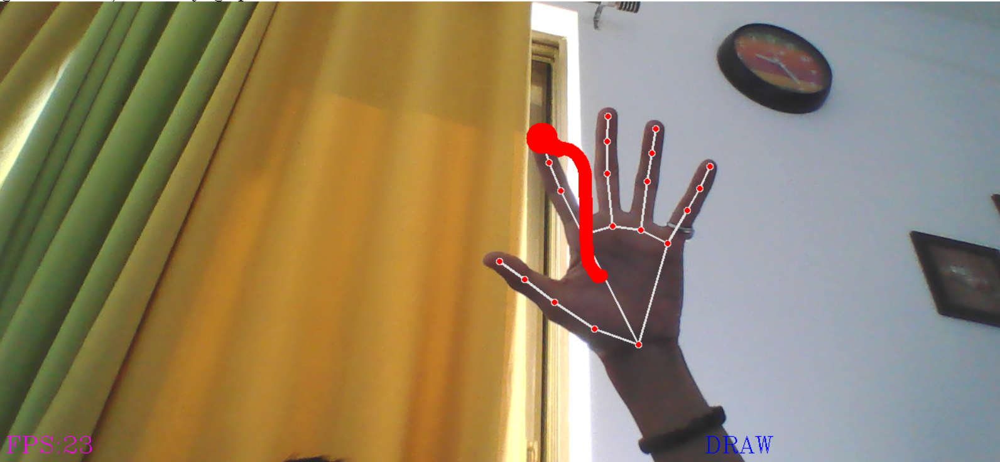

# Virtual Paint 🎨

Imagine painting with your fingertips, as if on a virtual canvas. **Virtual Paint** is a revolutionary system that allows you to express yourself with breathtaking fluidity and freedom—no stylus, no mess, just pure creative flow.

## Features

- **Hand Tracking**: Track your hand(s) and fingertips effortlessly in real time.
- **Drawing on Virtual Canvas**: Paint directly onto a virtual canvas using gestures.
- **Custom Colors and Thickness**: Choose colors and brush sizes dynamically.
- **Lightweight and Efficient**: Powered by OpenCV and Mediapipe for seamless performance.

## How It Works

This project uses a custom **Hand Tracking Library**, built on top of **OpenCV** and **Mediapipe**, to detect and track your hand movements. The fingertip positions are mapped to a virtual canvas, allowing you to draw with intuitive gestures.

## Screenshot




## Installation

Follow these steps to run the project locally:

1. Clone this repository:
    ```bash
    git clone https://github.com/abhi100om/virtual-paint.git
    ```
2. Navigate to the project directory:
    ```bash
    cd virtual-paint
    ```
3. Install the required dependencies:
    ```bash
    pip install -r requirements.txt
    ```
    Ensure you have Python 3.7+ installed on your system.

4. Run the application:
    ```bash
    python virtual_paint.py
    ```

## Requirements

- Python 3.7+
- OpenCV
- Mediapipe

## Usage

1. Launch the application.
2. Use your index finger to start drawing on the virtual canvas.
3. Select colors and brush sizes using specific gestures (e.g., pointing at virtual buttons).

## Contributing

Contributions are welcome! If you’d like to improve this project or add new features:
- Fork the repository.
- Create a new branch for your feature:
    ```bash
    git checkout -b feature-name
    ```
- Commit and push your changes:
    ```bash
    git push origin feature-name
    ```
- Open a pull request.

## License

This project is licensed under the [MIT License](LICENSE).

---

Happy painting! 🎨✨
